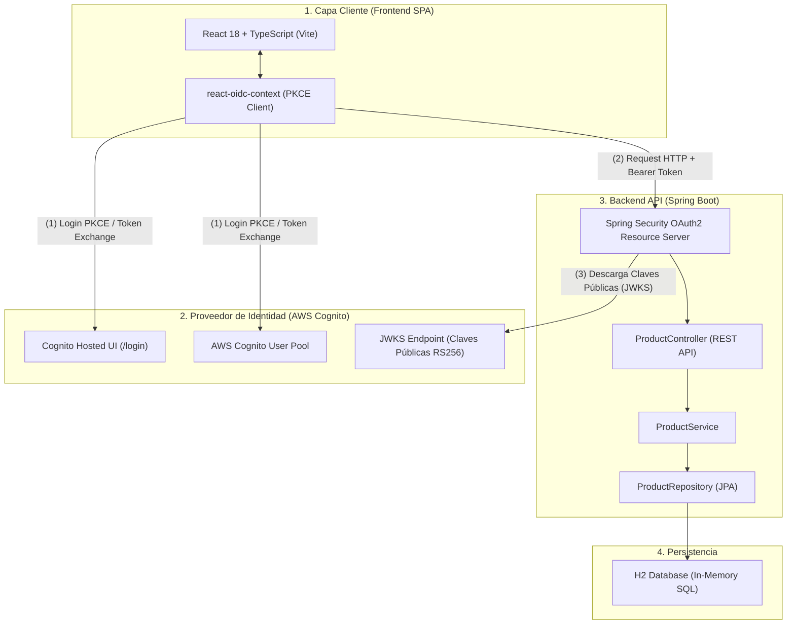
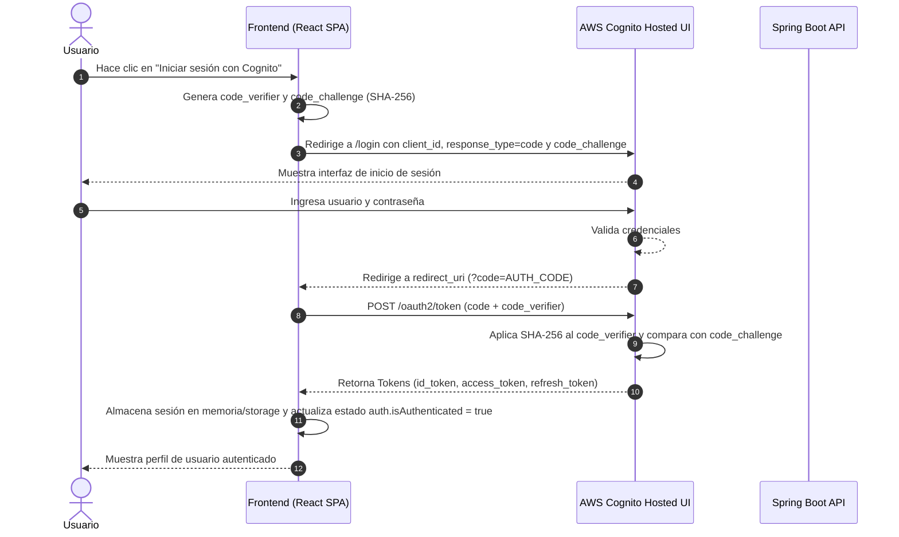
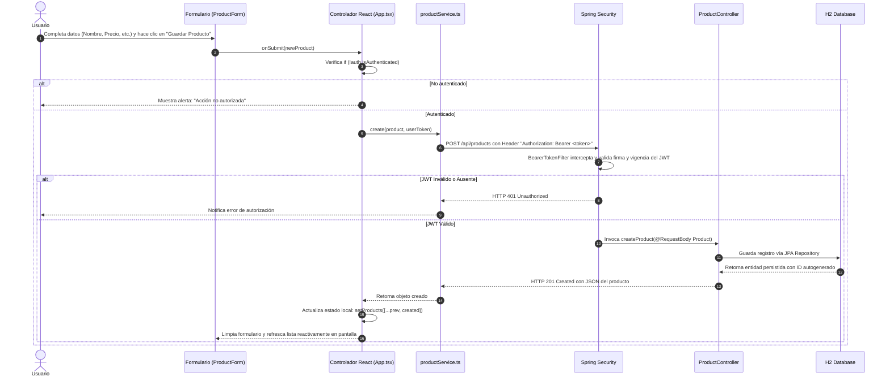

# Compendio Técnico: Arquitectura, Seguridad y Flujo de Autenticación JWT

Este documento consolida y responde de forma exhaustiva las preguntas conceptuales, técnicas y operativas sobre el sistema de gestión de productos, el protocolo de autenticación con **AWS Cognito (IDaaS)** y la seguridad en **Spring Boot** y **React**.

---

## 1. Stack Tecnológico Utilizado en la Solución

El ecosistema está construido bajo una arquitectura desacoplada cliente-servidor orientada a servicios REST sin estado (*Stateless*):

* **Frontend (Cliente SPA):**
  * **React 18 + TypeScript:** Interfaz de usuario declarativa, tipado estricto y componentes modulares.
  * **Vite:** Empaquetador y entorno de desarrollo de alto rendimiento.
  * **react-oidc-context / oidc-client-ts:** Gestión del ciclo de vida OpenID Connect (OIDC), almacenamiento de sesión, renovación de tokens y redirecciones.
  * **Vanilla CSS Moderno:** Diseño responsivo con temas oscuros, estética glassmorphism y micro-interacciones.

* **Backend (Servidor de Recursos / Resource Server):**
  * **Java 21:** Versión LTS con rendimiento y optimizaciones de memoria modernas.
  * **Spring Boot 4.x / 3.x:** Framework base para desarrollo rápido de microservicios.
  * **Spring Security 6 (OAuth2 Resource Server):** Protección de rutas, validación nativa criptográfica de tokens y control de accesos.
  * **Spring Data JPA / Hibernate:** Capa de abstracción y persistencia objeto-relacional (ORM).
  * **H2 Database:** Base de datos relacional SQL en memoria para pruebas y desarrollo ágil.
  * **Lombok:** Reducción de código repetitivo (Boilerplate).

* **Proveedor de Identidad (IDaaS):**
  * **AWS Cognito User Pools:** Gestión centralizada de usuarios, emisión de tokens firmados y Hosted UI.

---

## 2. Arquitectura del Stack Tecnológico

El siguiente diagrama ilustra la separación de responsabilidades y la interacción entre los tres pilares del sistema:



---

## 3. Flujo de Trabajo: Desde presionar "Login" hasta tener la sesión iniciada

El sistema implementa el flujo estándar **Authorization Code Flow con PKCE (Proof Key for Code Exchange)**:



1. **Petición de Login:** El usuario presiona el botón. La librería `react-oidc-context` crea una semilla criptográfica aleatoria (`code_verifier`) y calcula su hash SHA-256 (`code_challenge`).
2. **Redirección al IDaaS:** El navegador es dirigido al dominio seguro de Cognito (`/login`) transmitiendo el `code_challenge`, `client_id` y `redirect_uri`.
3. **Autenticación en Cognito:** El usuario ingresa sus credenciales en la Hosted UI administrada por AWS.
4. **Retorno con Código:** Cognito redirige al frontend con un código de autorización temporal de un solo uso en la URL (`?code=...`).
5. **Intercambio Seguro (Token Exchange):** El cliente realiza una petición POST interna al endpoint `/oauth2/token` de Cognito enviando el `code` y el `code_verifier` original.
6. **Validación y Entrega:** Cognito verifica que el hash del `code_verifier` coincida con el `code_challenge` inicial y entrega los tokens en formato JSON.
7. **Sesión Iniciada:** El frontend extrae el payload del usuario y activa la interfaz en modo autenticado.

---

## 4. ¿Qué es PKCE y por qué se utiliza?

**PKCE (Proof Key for Code Exchange, RFC 7636)** es una extensión de seguridad para OAuth 2.0 diseñada para mitigar el ataque de interceptación del código de autorización en **clientes públicos** (Single Page Applications, aplicaciones móviles o de escritorio).

### ¿Por qué nació?
* En clientes confidenciales (como un servidor backend tradicional), el cliente posee un `client_secret` privado que nunca sale del servidor.
* En clientes públicos (como una aplicación React en el navegador), cualquier usuario o script malicioso con acceso a la consola o a las herramientas de desarrollo puede inspeccionar el código fuente. Por ende, **no se puede almacenar un secreto de forma segura**.
* Sin PKCE, si un actor malicioso interceptaba el `authorization_code` (por ejemplo, mediante extensiones maliciosas del navegador o secuestro de URL), podía intercambiarlo directamente por tokens de acceso.

### ¿Cómo lo soluciona?
1. El cliente genera un secreto efímero y único por cada login: el `code_verifier`.
2. Genera una transformación unidireccional: `code_challenge = BASE64URL(SHA256(code_verifier))`.
3. Envía únicamente el `code_challenge` al solicitar el código.
4. Al canjear el código, envía el `code_verifier`. Como solo el emisor original conoce el valor previo al hash, Cognito valida matemáticamente la correspondencia, impidiendo que un tercero intercepte y canjee el código.

---

## 5. Estructura de un JWT (JSON Web Token)

Un JWT es una cadena de texto compacta y URL-safe dividida en tres partes separadas por puntos (`.`): `Header.Payload.Signature`.

```
eyJhbGciOiJSUzI1NiIsInR5cCI6IkpXVCJ9.eyJzdWIiOiIxMjM0NTYiLCJlbWFpbCI6InVzZXJAZXhhbXBsZS5jb20ifQ.d8f9a...
|___________________________________| |________________________________________________________| |________|
               Header                                         Payload                                Signature
```

### 1. Header (Encabezado)
Contiene los metadatos del token y el algoritmo de firma criptográfica utilizado.
```json
{
  "kid": "clave-publica-cognito-id-xyz",
  "alg": "RS256",
  "typ": "JWT"
}
```

### 2. Payload (Cuerpo de Datos / Claims)
Contiene la información de identidad (claims) del usuario y de la sesión:
* **Claims registrados:** `iss` (emisor), `sub` (identificador único del usuario), `exp` (fecha de expiración Unix), `iat` (emitido en).
* **Claims personalizados:** `cognito:username`, `email`, `cognito:groups`, `roles`.
```json
{
  "sub": "b2685791-7091-7078-4eb7-4a0d84c67923",
  "email_verified": true,
  "iss": "https://cognito-idp.us-east-1.amazonaws.com/us-east-1_OL9DjB9XL",
  "cognito:username": "operador_demo",
  "exp": 1725843600
}
```

### 3. Signature (Firma Criptográfica)
Se genera tomando el Header y el Payload codificados en Base64Url y firmándolos con la **clave privada** del emisor (AWS Cognito) mediante el algoritmo RS256:
```
Signature = RSASHA256(
  base64UrlEncode(header) + "." + base64UrlEncode(payload),
  privateKey
)
```

---

## 6. Manipulación de un JWT: Modificación de Roles y Consecuencias

### ¿Dónde se tendría que modificar?
Un atacante modificaría el **Payload**. Como el payload está codificado en Base64Url (no cifrado), basta con decodificarlo, alterar el claim:
```diff
- "cognito:groups": ["USER"]
+ "cognito:groups": ["ADMIN"]
```
y volver a codificarlo en Base64Url para rearmar el JWT.

### ¿Qué ocurriría exactamente?
El token será **rechazado de inmediato** con un error **HTTP 401 Unauthorized**:
1. La firma criptográfica (`Signature`) fue construida originalmente por AWS Cognito utilizando su **clave privada** sobre el contenido exacto del Header y el Payload originales.
2. Al alterar siquiera un solo byte del Payload, el cálculo matemático del hash cambia por completo.
3. Cuando el backend (Spring Security) recibe la petición, toma la **clave pública** de Cognito (JWKS) y verifica la firma contra el Header y el Payload recibidos.
4. Dado que el atacante no posee la clave privada de AWS Cognito para recalcular una firma válida para el nuevo payload, la verificación falla (`SignatureException` / `BadJwtException`).
5. El backend descarta la petición y no ejecuta la acción.

---

## 7. Diferencia entre IdToken y AccessToken: ¿Cuál debe enviarse al Backend?

| Característica | `id_token` (Token de Identidad) | `access_token` (Token de Acceso) |
| :--- | :--- | :--- |
| **Estándar** | OpenID Connect (OIDC). | OAuth 2.0 (RFC 6749 / RFC 6750). |
| **Destinatario** | El **Cliente (Frontend)** para saber quién es el usuario. | El **Servidor de Recursos (API / Backend)** para autorizar operaciones. |
| **Audiencia (`aud`)** | Contiene el `client_id` de la aplicación frontend. | Generalmente no contiene `aud` directo en Cognito, sino `client_id` y `scope`. |
| **Contenido habitual** | Datos del perfil (`name`, `email`, `email_verified`, `sub`). | Permisos, scopes de autorización (`aws.cognito.signin.user.admin`). |

### ¿Cuál debería enviarse?
* **Regla Estándar OAuth2:** Para consumir una API REST / Resource Server debe enviarse el **`access_token`**. Es el artefacto diseñado formalmente para portar privilegios de autorización.
* **Práctica común en Cognito:** Si el backend requiere extraer directamente claims de perfil como el correo electrónico o el nombre sin consultar el endpoint `/oauth2/userInfo`, Cognito permite validar el **`id_token`** siempre que el backend verifique el emisor (`iss`) y la firma criptográfica.

---

## 8. Cómo se Hizo la Implementación y Cómo se Valida el Token

### Evolución de la Implementación
1. **Fase Inicial (Manual con Nimbus JOSE):** Se implementó un filtro manual (`JwtAuthenticationFilter`) y un servicio (`JwtValidationService`) que descargaba manualmente las claves de Cognito con `RemoteJWKSet`, extraía los claims y seteaba el `SecurityContextHolder`.
2. **Fase Optimizada (Nativa con Spring Security):** Se migró a **Spring Security OAuth2 Resource Server**:
   * Se agregó el starter oficial `spring-boot-starter-oauth2-resource-server` en `pom.xml`.
   * Se configuró en `application.properties`:
     ```properties
     spring.security.oauth2.resourceserver.jwt.issuer-uri=https://cognito-idp.us-east-1.amazonaws.com/us-east-1_OL9DjB9XL
     ```
   * En `SecurityConfig.java` se activó de forma declarativa:
     ```java
     .oauth2ResourceServer(oauth2 -> oauth2.jwt(Customizer.withDefaults()))
     ```

### Flujo Lógico de Validación del Token en el Backend
Cuando entra una petición a una ruta protegida (`POST` o `DELETE`):
1. **Extracción:** El filtro `BearerTokenAuthenticationFilter` de Spring Security extrae el token de la cabecera `Authorization: Bearer <token>`.
2. **Descubrimiento de Claves (JWKS):** A través del `issuer-uri`, Spring Security consulta automáticamente `/.well-known/openid-configuration` de Cognito para obtener la URL de las claves públicas (`jwks.json`). Las claves son cacheadas en memoria.
3. **Verificación de Firma:** Utiliza la clave pública correspondiente al `kid` del token para certificar que el token fue firmado por la clave privada de AWS Cognito.
4. **Validación de Claims:**
   * **`iss` (Emisor):** Confirma que provenga exactamente del User Pool esperado.
   * **`exp` y `nbf` (Tiempos):** Confirma que el token no haya expirado y ya sea válido.
5. **Autenticación:** Si todo es correcto, crea un objeto `JwtAuthenticationToken` y lo establece en el contexto de seguridad (`SecurityContextHolder`). La petición prosigue hacia el controlador.

---

## 9. Flujo de la Aplicación: Agregar un Producto (End-to-End)

A continuación se detalla el ciclo de vida completo al crear un producto en el sistema:



---

## 10. Configuración de CORS (Cross-Origin Resource Sharing)

### ¿Dónde está configurada?
La configuración reside en dos puntos del backend:

1. **Configuración Global en [SecurityConfig.java](file:///c:/Users/sours/OneDrive/Escritorio/Proyectos%20programacion/Nueva%20carpeta/demo/src/main/java/com/example/demo/config/SecurityConfig.java):**
   ```java
   @Bean
   public CorsConfigurationSource corsConfigurationSource() {
       CorsConfiguration configuration = new CorsConfiguration();
       configuration.setAllowedOriginPatterns(List.of("*"));
       configuration.setAllowedMethods(List.of("GET", "POST", "PUT", "DELETE", "OPTIONS"));
       configuration.setAllowedHeaders(List.of("Authorization", "Content-Type", "Accept", "X-Requested-With"));
       configuration.setExposedHeaders(List.of("Authorization"));
       configuration.setAllowCredentials(true);

       UrlBasedCorsConfigurationSource source = new UrlBasedCorsConfigurationSource();
       source.registerCorsConfiguration("/**", configuration);
       return source;
   }
   ```
   * Habilita las solicitudes preflight `OPTIONS /**` sin autenticación.
   * Permite cabeceras críticas como `Authorization` para el envío del Bearer token.
2. **Anotación en el Controlador ([ProductController.java](file:///c:/Users/sours/OneDrive/Escritorio/Proyectos%20programacion/Nueva%20carpeta/demo/src/main/java/com/example/demo/controller/ProductController.java)):**
   ```java
   @CrossOrigin(origins = "*")
   ```

---

## 11. ¿Por qué se utiliza un IDaaS (Identity as a Service)?

Utilizar un proveedor como **AWS Cognito** en lugar de programar la autenticación tradicional ofrece ventajas críticas:

1. **Seguridad Robusta:** No se almacenan contraseñas sensibles en las bases de datos propias (eliminando el riesgo de filtración de hashes, sales y credenciales).
2. **Cumplimiento y Normativas:** Cumple con estándares internacionales de seguridad (GDPR, HIPAA, PCI-DSS, SOC 1/2/3).
3. **Funcionalidades Out-of-the-Box:** Soporte inmediato para autenticación multifactor (MFA), recuperación de contraseñas por correo/SMS, verificación de correos y políticas avanzadas de robustez de claves.
4. **Protección contra Amenazas:** Detección de ataques de fuerza bruta (*Credential Stuffing*), limitación de tasa y bloqueo de IPs maliciosas.
5. **Escalabilidad y Alta Disponibilidad:** Infraestructura gestionada por AWS capaz de escalar a millones de usuarios concurrentes sin mantenimiento de servidores.

---

## 12. ¿Por qué se utiliza un API Gateway?

Aunque en esta fase de desarrollo el Frontend conecta directamente con Spring Boot, en una arquitectura Cloud empresarial se interpone un **API Gateway** (como AWS API Gateway, Spring Cloud Gateway o Kong) por las siguientes razones:

1. **Punto Único de Entrada (Single Entrypoint):** Oculta la topología interna y la dirección de los microservicios del backend.
2. **Descarga de Autenticación (Offloading):** El API Gateway valida el JWT antes de remitir la petición al microservicio. Si el token es inválido, el gateway rechaza la petición directamente, ahorrando recursos y procesamiento a los servidores internos.
3. **Control de Tráfico y Rate Limiting:** Protege las APIs contra saturación o ataques de denegación de servicio (DoS) limitando peticiones por cliente o IP.
4. **CORS Centralizado:** Gestiona las políticas CORS en una sola capa perimetral.
5. **Métricas, Auditoría y WAF:** Centraliza el registro de accesos, monitoreo y protección contra inyecciones SQL o exploits mediante Web Application Firewalls (WAF).

---

## 13. Configuración Requerida en un IDaaS (AWS Cognito)

Para que el IDaaS se conecte e interactúe sin problemas con el frontend y el backend, deben configurarse los siguientes parámetros en la consola de AWS Cognito:

### En el User Pool (Grupo de Usuarios)
1. **Atributos de Registro:** Determinar identificadores (e.g. Email o Nombre de usuario) y atributos obligatorios.
2. **Políticas de Contraseña:** Longitud mínima, mayúsculas, números y símbolos.

### En el App Client (Cliente de Aplicación)
1. **Tipo de Cliente:** **Público** (Desactivar la opción de generar *Client Secret*, ya que las aplicaciones React en el navegador no pueden ocultarlo).
2. **Allowed Callback URLs (URLs de Retorno):** Registrar explícitamente `http://localhost:5173/` (o el dominio de producción). Cualquier URL no registrada será rechazada por Cognito por seguridad.
3. **Allowed Sign-out URLs (URLs de Cierre de Sesión):** Registrar `http://localhost:5173/` para redirección tras el logout.
4. **OAuth 2.0 Grant Types:** Habilitar **Authorization code grant** (con soporte PKCE forzado).
5. **OpenID Connect Scopes:** Activar los alcances requeridos: `openid`, `email`, `phone`, `profile`.

### En el Dominio de Cognito
* Definir un subdominio para la interfaz web gestionada (e.g. `us-east-1ol9djb9xl.auth.us-east-1.amazoncognito.com`). Es el host donde se despliega la Hosted UI para el login.

---

## 14. Resumen Integrado: Explicación de Todo el Ecosistema

El sistema opera bajo un modelo de **confianza cero (Zero Trust) y desacoplamiento absoluto**:

* El **Frontend** jamás manipula credenciales directas (usuario y contraseña nunca tocan los servidores de la aplicación, viajan exclusivamente hacia AWS Cognito mediante la Hosted UI).
* El **IDaaS (Cognito)** asume la responsabilidad de autenticar, gestionar identidades y certificar la autenticidad emitiendo JWTs criptográficamente firmados con clave asimétrica privada (RS256).
* El **Backend (Spring Boot)** se desempeña como un Servidor de Recursos sin estado (*Stateless*). No guarda sesiones en memoria ni bases de datos; cada petición es autónoma y se valida contra las claves públicas expuestas por Cognito en su endpoint JWKS.
* La **Integridad** está garantizada: cualquier alteración de roles o privilegios en el token resulta en un desajuste de la firma matemática, bloqueando automáticamente accesos indebidos.
