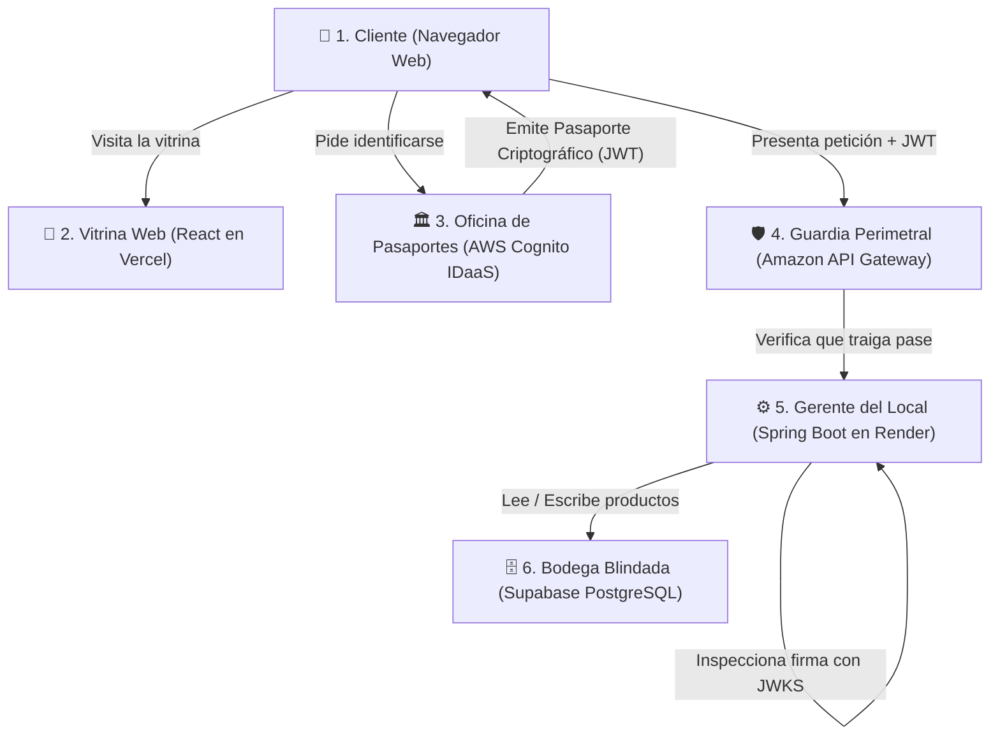

# 📘 Guía Definitiva y Amigable del Proyecto Completo: De Cero a Experto 🚀

> **Propósito de esta guía:** Explicar **TODO** el proyecto (Frontend, Backend, Base de Datos, AWS Cognito, API Gateway y Despliegues Cloud) con un lenguaje completamente amigable, claro y sin enredos para estudiantes. Incluye el análisis del código línea por línea, diagramas intuitivos, analogías cotidianas y el **banco de preguntas y respuestas exactas** para defender la evaluación final con una nota sobresaliente.
>
> *(Los conceptos más críticos e indispensables para la presentación están destacados en amarillo con `<mark>` para facilitar su estudio).*

---

## 📑 Tabla de Contenidos

1. [La Gran Historia del Proyecto (Con peras y manzanas)](#-capítulo-1-la-gran-historia-del-proyecto)
2. [El Stack Tecnológico y el Rol de cada Componente](#-capítulo-2-el-stack-tecnológico-explicado-fácil)
3. [El Viaje de los Datos: Flujos Paso a Paso en Lenguaje Humano](#-capítulo-3-el-viaje-de-los-datos-flujos-paso-a-paso)
4. [El Código Explicado Línea por Línea (Frontend, Backend y BD)](#-capítulo-4-el-código-explicado-línea-por-línea)
5. [Infraestructura Cloud y Configuración Real (AWS, Supabase, Render, Vercel)](#-capítulo-5-infraestructura-cloud-y-despliegue)
6. [El Gran Banco de Preguntas y Respuestas de Evaluación](#-capítulo-6-el-gran-banco-de-preguntas-y-respuestas)
7. [Guion de Presentación para 30 Minutos (Rúbrica al 100%)](#-capítulo-7-guion-para-la-presentación-de-30-minutos)

---

# 🏢 CAPÍTULO 1: LA GRAN HISTORIA DEL PROYECTO

### La analogía de la "Tienda Exclusiva y Segura"

Imagina que hemos construido una **tienda digital de productos de alta seguridad**. En el mundo real, esta tienda funciona así:



1. <mark>**El Frontend (React en Vercel):**</mark> Es la **vitrina pública**. Muestra las fotos, precios y botones bonitos. Cualquiera puede mirar la vitrina, pero no puede tocar los productos sin identificarse.
2. <mark>**AWS Cognito (IDaaS):**</mark> Es la **oficina de pasaportes del gobierno**. Cuando el usuario quiere comprar o crear un producto, la vitrina lo envía a esta oficina. El usuario pone su clave secreta en los servidores de Amazon (nunca en los nuestros). Si la clave es correcta, Amazon le entrega un **pasaporte digital sellado e infalsificable llamado JWT (JSON Web Token)**.
3. <mark>**Amazon API Gateway:**</mark> Es el **guardia de seguridad en la reja exterior**. Si alguien intenta entrar sin pasaporte o con malas intenciones, el guardia lo echa de inmediato antes de que gaste los recursos del local.
4. <mark>**El Backend (Spring Boot en Render):**</mark> Es el **gerente de operaciones**. Recibe la orden del cliente junto con el pasaporte JWT. Con una lupa matemática especial (criptografía asimétrica), comprueba que el sello de Amazon sea 100% auténtico. Si es válido, ejecuta la operación.
5. <mark>**Supabase (PostgreSQL en la Nube):**</mark> Es la **bodega de almacenamiento**. Aquí están guardadas las tablas con los productos. Si el servidor se apaga o reinicia, nada se pierde porque la bodega es permanente.

---

# 🧰 CAPÍTULO 2: EL STACK TECNOLÓGICO EXPLICADO FÁCIL

| Componente | Tecnología Utilizada | ¿Qué hace en palabras sencillas? | ¿Por qué se eligió? |
| :--- | :--- | :--- | :--- |
| **Frontend** | React 19 + TypeScript + Vite | La interfaz de usuario que corre en el navegador del cliente. | Rápido, reactivo, modular y con tipado seguro que evita errores de código. |
| **Hosting Frontend** | Vercel (Cloud Serverless) | Servidor mundial de distribución que entrega el sitio web en milisegundos. | Despliegue continuo con Git, certificado HTTPS gratuito y alta disponibilidad. |
| **IDaaS (Identidad)** | AWS Cognito (User Pool) | Administra los usuarios, contraseñas, confirmación de correo y tokens de seguridad. | No guardamos contraseñas en nuestra BD, cumpliendo estándares mundiales (ISO 27001, OWASP). |
| **Puerta de Enlace** | Amazon API Gateway | Punto de entrada público en la nube de AWS para las APIs. | Centraliza el tráfico, controla CORS, filtra peticiones y protege al backend. |
| **Backend** | Spring Boot 3.4 + Java 17 | La lógica de negocio y las reglas de seguridad. | Estándar de la industria financiera y corporativa; robusto, escalable y con Spring Security nativo. |
| **Hosting Backend** | Render Cloud Platform | Servidor en la nube donde compila y se ejecuta nuestro contenedor Java. | Despliegue automático desde GitHub, URL pública HTTPS y soporte nativo Java. |
| **Base de Datos** | PostgreSQL en Supabase | Almacén relacional donde viven las tablas `products`. | Motor SQL potente, administración visual en la nube y conexión por **Session Pooler** (puerto 5432). |

---

# 🔄 CAPÍTULO 3: EL VIAJE DE LOS DATOS (FLUJOS PASO A PASO)

---

### Flujo 1: ¿Qué pasa cuando el usuario hace clic en "Iniciar Sesión"?

```
[Usuario hace clic en Login]
        │
        ▼
[React genera código aleatorio de seguridad (PKCE)]
        │
        ▼ Redirección 302
[Pantalla de Login alojada por AWS Cognito]
        │
        ▼ Usuario ingresa correo y contraseña
[AWS Cognito valida las credenciales en sus bóvedas]
        │
        ▼ Redirección al Frontend con un "Code" temporal
[React recibe el "Code" y lo intercambia por el JWT]
        │
        ▼
[React guarda el Access Token en memoria y actualiza la Navbar]
```

1. **El usuario hace clic en "Iniciar sesión":** El frontend no le pide la contraseña ahí mismo. En su lugar, prepara un código secreto llamado **PKCE (Proof Key for Code Exchange)** para evitar espías.
2. **Viaje a Amazon:** El navegador viaja a la página oficial de AWS Cognito (`us-east-1ol9djb9xl.auth...`).
3. **Autenticación segura:** El usuario escribe sus datos en Amazon. <mark>Nuestra aplicación jamás ve ni toca la contraseña del usuario.</mark>
4. **Regreso triunfal:** Amazon redirige al usuario de vuelta a nuestro frontend (`https://soluciones-cloud-v1.vercel.app/`) trayendo un "código de canje" de un solo uso.
5. **El canje:** En milisegundos y por debajo de la mesa, la librería de React le entrega ese código a Amazon y Amazon le devuelve dos tokens:
   - **`id_token`:** La credencial de identidad con su nombre y correo (para mostrar en la pantalla).
   - **`access_token`:** La llave maestra con los permisos (para enviarle al backend).

---

### Flujo 2: ¿Qué pasa cuando el usuario hace clic en "Crear Producto"?

```
[Usuario llena el formulario y presiona "Guardar"]
        │
        ▼
[React adjunta el Access Token en el encabezado: Authorization: Bearer eyJhbGciOi...]
        │
        ▼ Llamada HTTP POST
[Amazon API Gateway recibe la petición]
        │ ── Verifica CORS y métodos permitidos
        ▼
[Spring Boot intercepta la petición en su filtro perimetral (BearerTokenAuthenticationFilter)]
        │
        ├── 1. Lee la cabecera "Authorization" y extrae el token.
        ├── 2. Extrae el campo "kid" (Key ID) de la cabecera del token.
        ├── 3. Busca la clave pública de Amazon en su memoria caché (JWKS).
        ├── 4. Realiza el cálculo matemático de verificación de la firma.
        ├── 5. Comprueba que el token no haya expirado (exp).
        └── 6. Comprueba que el emisor sea nuestro User Pool de AWS (iss).
        │
        ▼ (Si todo es correcto, la petición pasa al controlador)
[ProductController recibe el JSON y llama a ProductService]
        │
        ▼
[ProductRepository ejecuta INSERT INTO products... en Supabase PostgreSQL]
        │
        ▼
[Supabase guarda el registro y devuelve el producto con su ID generado]
        │
        ▼
[El Backend responde 200 OK con el producto creado en formato JSON]
        │
        ▼
[React recibe el 200 OK, agrega el producto a la lista visual y muestra notificación verde]
```

---

# 💻 CAPÍTULO 4: EL CÓDIGO EXPLICADO LÍNEA POR LÍNEA

---

## 1. FRONTEND: Las piezas clave de React

### A) El archivo de conexión: [`frontend/src/auth/authConfig.ts`](file:///c:/Users/sours/OneDrive/Escritorio/Proyectos%20programacion/Nueva%20carpeta/frontend/src/auth/authConfig.ts)

*Es el mapa que le dice a la aplicación React dónde está AWS Cognito y cómo hablar con él.*

```typescript
// 1. Dominio donde Amazon hospeda nuestra interfaz de login
const cognitoDomain = 'https://us-east-1ol9djb9xl.auth.us-east-1.amazoncognito.com';

export const cognitoAuthConfig: AuthProviderProps = {
  // 2. ¿Quién es la autoridad que emite los tokens válidos?
  authority: 'https://cognito-idp.us-east-1.amazonaws.com/us-east-1_OL9DjB9XL',

  // 3. El ID de nuestra aplicación registrado en AWS (como el RUT de la app)
  client_id: '53acsgrc0tneq7jhigesj93g8r',

  // 4. A dónde debe volver el navegador tras hacer login.
  // TRUCO PRO: window.location.origin detecta automáticamente si estás en localhost:5173 o en Vercel
  redirect_uri: typeof window !== 'undefined' ? window.location.origin + '/' : 'https://soluciones-cloud-v1.vercel.app/',

  // 5. 'code' le indica a Amazon que usaremos el flujo seguro PKCE (Authorization Code Flow)
  response_type: 'code',

  // 6. Los datos que le solicitamos a Amazon sobre el perfil del usuario
  scope: 'email openid phone',

  // 7. Los endpoints oficiales de Amazon para login, logout, token y llaves criptográficas (JWKS)
  metadata: {
    issuer: 'https://cognito-idp.us-east-1.amazonaws.com/us-east-1_OL9DjB9XL',
    authorization_endpoint: `${cognitoDomain}/login`,
    token_endpoint: `${cognitoDomain}/oauth2/token`,
    userinfo_endpoint: `${cognitoDomain}/oauth2/userInfo`,
    end_session_endpoint: `${cognitoDomain}/logout`,
    jwks_uri: 'https://cognito-idp.us-east-1.amazonaws.com/us-east-1_OL9DjB9XL/.well-known/jwks.json',
  },

  // 8. Limpia los códigos temporales de la URL una vez completado el inicio de sesión
  onSigninCallback: () => {
    window.history.replaceState({}, document.title, window.location.pathname);
  },
};
```

---

### B) El mensajero que viaja con el Token: [`frontend/src/services/productService.ts`](file:///c:/Users/sours/OneDrive/Escritorio/Proyectos%20programacion/Nueva%20carpeta/frontend/src/services/productService.ts)

*Cada vez que React necesita hablar con el Backend o el API Gateway, esta función mete el token en la maleta.*

```typescript
// Dirección oficial del backend (puede ser API Gateway o Render)
const API_URL = 'https://8086dx45a7.execute-api.us-east-1.amazonaws.com/prod/api/products';

// Función auxiliar para fabricar las cabeceras HTTP
const getAuthHeaders = (token?: string): HeadersInit => {
  const headers: HeadersInit = {
    'Content-Type': 'application/json', // Le avisamos al backend que enviamos JSON
  };
  
  // ¡AQUÍ ESTÁ LA CLAVE DE LA SEGURIDAD!
  // Si tenemos token, lo pegamos en el header 'Authorization' con el prefijo 'Bearer '
  if (token) {
    headers['Authorization'] = `Bearer ${token}`;
  }
  return headers;
};

export const productService = {
  // Obtener productos: Pasamos el token para que el backend nos dé permiso de leer
  async getAll(token?: string): Promise<Product[]> {
    const response = await fetch(API_URL, {
      headers: getAuthHeaders(token),
    });
    if (!response.ok) throw new Error('Error al cargar productos');
    return response.json();
  },

  // Crear producto: Enviamos el JSON del producto y el Token en la cabecera
  async create(product: CreateProductDTO, token: string): Promise<Product> {
    const response = await fetch(API_URL, {
      method: 'POST',
      headers: getAuthHeaders(token),
      body: JSON.stringify(product),
    });
    if (!response.ok) throw new Error('Error al crear producto');
    return response.json();
  }
};
```

---

## 2. BACKEND: Las piezas clave de Spring Boot

---

### A) El guardián perimetral: [`SecurityConfig.java`](file:///c:/Users/sours/OneDrive/Escritorio/Proyectos%20programacion/Nueva%20carpeta/src/main/java/com/example/soluciones_cloud_v1/config/SecurityConfig.java)

*Este es el archivo más importante de todo el backend. Configura Spring Security para que funcione como un **OAuth2 Resource Server**.*

```java
@Configuration
@EnableWebSecurity
public class SecurityConfig {

    @Bean
    public SecurityFilterChain securityFilterChain(HttpSecurity http) throws Exception {
        http
            // 1. Deshabilitamos CSRF porque nuestra arquitectura es Stateless (no usa cookies de sesión)
            .csrf(csrf -> csrf.disable())

            // 2. Activamos la configuración de CORS para que Vercel pueda hacer peticiones
            .cors(cors -> cors.configurationSource(corsConfigurationSource()))

            // 3. Establecemos la política de sesión sin estado (STATELESS)
            // El servidor NO guarda sesiones en memoria; cada petición debe traer su propio token
            .sessionManagement(session -> 
                session.sessionCreationPolicy(SessionCreationPolicy.STATELESS)
            )

            // 4. Reglas de autorización de endpoints
            .authorizeHttpRequests(auth -> auth
                // Las peticiones OPTIONS (pre-vuelo del navegador) se permiten siempre
                .requestMatchers(HttpMethod.OPTIONS, "/**").permitAll()
                // El endpoint de health check es público para que Render sepa si el servidor está vivo
                .requestMatchers("/api/health/**", "/health").permitAll()
                // CUALQUIER otra petición exige estar autenticado con un token válido
                .anyRequest().authenticated()
            )

            // 5. ¡LA LÍNEA MÁGICA! 
            // Convierte a Spring Boot en un Resource Server que valida JWT automáticamente contra AWS Cognito
            .oauth2ResourceServer(oauth2 -> oauth2.jwt(Customizer.withDefaults()));

        return http.build();
    }
}
```

> **¿Qué hace exactamente `.oauth2ResourceServer(oauth2 -> oauth2.jwt(...))`?**  
> Activa un filtro interno en Spring Boot (`BearerTokenAuthenticationFilter`). Este filtro atrapa la cabecera `Authorization: Bearer <token>`, extrae el JWT, se conecta con la URL de JWKS de Amazon, descarga las llaves públicas criptográficas, comprueba la firma matemática y si es válida, deja pasar la petición. <mark>Todo sin escribir una sola línea de código manual propensa a fallos.</mark>

---

### B) Las variables de conexión: [`application.yml`](file:///c:/Users/sours/OneDrive/Escritorio/Proyectos%20programacion/Nueva%20carpeta/src/main/resources/application.yml)

```yaml
spring:
  # 1. Configuración de Spring Security con AWS Cognito
  security:
    oauth2:
      resourceserver:
        jwt:
          # URL del emisor (Issuer): Spring Boot descarga automáticamente / .well-known/jwks.json desde aquí
          issuer-uri: https://cognito-idp.us-east-1.amazonaws.com/us-east-1_OL9DjB9XL

  # 2. Conexión a la Base de Datos PostgreSQL de Supabase
  datasource:
    # Usamos el Session Pooler en el puerto 5432 (aws-0-us-east-1.pooler.supabase.com)
    url: ${SPRING_DATASOURCE_URL:jdbc:postgresql://aws-0-us-east-1.pooler.supabase.com:5432/postgres?sslmode=require}
    username: ${SPRING_DATASOURCE_USERNAME:postgres.xuffliucihabnrodubse}
    password: ${SPRING_DATASOURCE_PASSWORD:87749584aA.}
    driver-class-name: org.postgresql.Driver

  # 3. Configuración del ORM Hibernate
  jpa:
    hibernate:
      ddl-auto: update # Crea o actualiza las columnas si cambian en el modelo Java
    show-sql: true     # Muestra las consultas SQL en la consola para depuración
```

---

### C) El controlador de negocio: [`ProductController.java`](file:///c:/Users/sours/OneDrive/Escritorio/Proyectos%20programacion/Nueva%20carpeta/src/main/java/com/example/soluciones_cloud_v1/controller/ProductController.java)

```java
@RestController
@RequestMapping("/api/products")
public class ProductController {

    private final ProductService productService;

    public ProductController(ProductService productService) {
        this.productService = productService;
    }

    // GET /api/products: Lista todos los productos (protegido por JWT)
    @GetMapping
    public ResponseEntity<List<Product>> getAllProducts() {
        return ResponseEntity.ok(productService.getAllProducts());
    }

    // POST /api/products: Recibe el nuevo producto en el cuerpo y lo guarda en Supabase
    @PostMapping
    public ResponseEntity<Product> createProduct(@Valid @RequestBody ProductDTO productDTO) {
        Product savedProduct = productService.createProduct(productDTO);
        return ResponseEntity.status(HttpStatus.CREATED).body(savedProduct);
    }
}
```

---

# ☁️ CAPÍTULO 5: INFRAESTRUCTURA CLOUD Y DESPLIEGUE

---

### 1. AWS Cognito (El Proveedor de Identidad - IDaaS)
* **Región:** `us-east-1` (N. Virginia).
* **User Pool ID:** `us-east-1_OL9DjB9XL`.
* **App Client ID:** `53acsgrc0tneq7jhigesj93g8r` (Configurado como **Public Client** sin Client Secret para que una app SPA de React pueda usarlo con PKCE).
* **Allowed Callback URLs:**
  - `http://localhost:5173/` (para pruebas en tu computadora).
  - `https://soluciones-cloud-v1.vercel.app/` (para la producción en internet).
* **Allowed OAuth Flows:** Authorization code grant con PKCE.
* **OAuth Scopes:** `openid`, `email`, `phone`.

---

### 2. Amazon API Gateway (La Puerta de Entrada Perimetral)
* **ID:** `8086dx45a7`.
* **Etapa (Stage):** `prod`.
* **URL Pública:** `https://8086dx45a7.execute-api.us-east-1.amazonaws.com/prod/api/products`
* **Tipo de Integración:** **HTTP Proxy Integration**.
* **Destino del Proxy:** Redirige todo el tráfico hacia el backend real en Render:
  `https://soluciones-cloud-v1.onrender.com/api/products`
* **Configuración CORS en API Gateway:**
  - Métodos habilitados: `GET`, `POST`, `OPTIONS`.
  - Encabezados permitidos (`Access-Control-Allow-Headers`): `Content-Type,X-Amz-Date,Authorization,X-Api-Key,X-Amz-Security-Token`.

---

### 3. Supabase PostgreSQL (La Base de Datos en la Nube)
* **Host:** `aws-0-us-east-1.pooler.supabase.com`
* **Puerto:** <mark>**`5432` (Session Pooler)**</mark>
* **¿Por qué el Session Pooler y no conexión directa?**
  Las redes de Render y entornos Cloud modernos a veces tienen problemas para resolver conexiones directas IPv6 de Supabase. El **Session Pooler (puerto 5432)** ofrece compatibilidad universal IPv4, gestiona eficientemente el conjunto de conexiones de Spring Boot (HikariCP) y evita que la base de datos colapse si muchos usuarios entran al mismo tiempo.

---

### 4. Despliegues Cloud (Render y Vercel)
* **Frontend en Vercel:** Compila con Node.js y distribuye los archivos estáticos en una red global CDN. Responde en segundos con HTTPS automático.
* **Backend en Render:** Utiliza un Web Service con entorno nativo Java 17. Al hacer `git push main`, Render compila con Maven (`./mvnw clean package -DskipTests`) y ejecuta el `.jar` resultante.

---

# ❓ CAPÍTULO 6: EL GRAN BANCO DE PREGUNTAS Y RESPUESTAS

*(Aquí tienes las respuestas exactas y contundentes a todas las preguntas que el evaluador te puede hacer).*

---

### ❓ Pregunta 1: "¿Cuál es el flujo de trabajo desde presionar Login hasta tener la sesión iniciada?"
> **Respuesta Maestra:**  
> 1. El usuario hace clic en "Iniciar Sesión" en la barra de navegación de React.  
> 2. React genera dos claves temporales: un **Code Verifier** (secreto local) y un **Code Challenge** (cálculo SHA-256 del verifier) usando el estándar **PKCE**.  
> 3. El navegador se redirige a la página alojada de AWS Cognito con el `client_id`, `redirect_uri` y el `code_challenge`.  
> 4. El usuario introduce sus credenciales directamente en los servidores seguros de AWS.  
> 5. Cognito valida los datos y redirige al navegador a nuestra `redirect_uri` (`https://soluciones-cloud-v1.vercel.app/`) adjuntando un **Authorization Code** de un solo uso en la URL.  
> 6. El frontend intercepta el código y hace una petición interna por detrás al endpoint `/oauth2/token` de Cognito, enviando el código junto con el **Code Verifier** original.  
> 7. Cognito comprueba que el verifier coincide con el challenge y responde entregando los tokens: `id_token` y `access_token`.  
> 8. React guarda el token en memoria (`react-oidc-context`), limpia la URL con `window.history.replaceState` y actualiza la pantalla mostrando el correo del usuario logueado.

---

### ❓ Pregunta 2: "¿Cómo se hicieron las implementaciones en el Backend y Frontend?"
> **Respuesta Maestra:**  
> * **En el Frontend:** Se instaló `react-oidc-context` y `oidc-client-ts`. Se creó [`authConfig.ts`](file:///c:/Users/sours/OneDrive/Escritorio/Proyectos%20programacion/Nueva%20carpeta/frontend/src/auth/authConfig.ts) con las coordenadas de Cognito, se envolvió la app en `<AuthProvider>` en [`main.tsx`](file:///c:/Users/sours/OneDrive/Escritorio/Proyectos%20programacion/Nueva%20carpeta/frontend/src/main.tsx), y en [`productService.ts`](file:///c:/Users/sours/OneDrive/Escritorio/Proyectos%20programacion/Nueva%20carpeta/frontend/src/services/productService.ts) se inyectó la cabecera `Authorization: Bearer <token>` en cada llamada HTTP.  
> * **En el Backend:** Se incorporó la dependencia `spring-boot-starter-oauth2-resource-server` en el [`pom.xml`](file:///c:/Users/sours/OneDrive/Escritorio/Proyectos%20programacion/Nueva%20carpeta/pom.xml). En [`application.yml`](file:///c:/Users/sours/OneDrive/Escritorio/Proyectos%20programacion/Nueva%20carpeta/src/main/resources/application.yml) se definió el `issuer-uri` apuntando a Cognito. En [`SecurityConfig.java`](file:///c:/Users/sours/OneDrive/Escritorio/Proyectos%20programacion/Nueva%20carpeta/src/main/java/com/example/soluciones_cloud_v1/config/SecurityConfig.java) se estableció la política sin estado (`STATELESS`) y se activó el validador automático de JWT.

---

### ❓ Pregunta 3: "¿Cuál es el flujo lógico y cómo valida el Backend el Token sin consultar a Cognito a cada rato?"
> **Respuesta Maestra:**  
> El backend utiliza **criptografía asimétrica (llave pública / llave privada)**:  
> 1. AWS Cognito posee la **llave privada** (secreta y resguardada por Amazon), con la cual estampa la firma digital en el token.  
> 2. Spring Boot al arrancar descarga las **llaves públicas** de Amazon desde la URL oficial JWKS (`.../.well-known/jwks.json`) y las guarda en memoria caché.  
> 3. Cuando llega una petición con `Authorization: Bearer <token>`, el filtro de Spring Security extrae el `kid` (Key ID) de la cabecera del token y aplica una función matemática con la llave pública correspondiente.  
> 4. Si el resultado coincide, **queda matemáticamente demostrado que el token fue firmado por Amazon y no ha sido alterado**.  
> 5. <mark>Por eso es una arquitectura 100% Stateless: el backend no necesita llamar a AWS Cognito ni a la base de datos en cada petición, lo que hace al sistema extremadamente rápido y escalable.</mark>

---

### ❓ Pregunta 4: "¿Cuál es la diferencia entre ID Token y Access Token, y cuál debe enviarse al Backend?"
> **Respuesta Maestra:**  
> * <mark>**ID Token:**</mark> Cumple el estándar **OpenID Connect (OIDC)**. Contiene datos del perfil del usuario (nombre, correo, teléfono, fecha de creación). **Es exclusivo para el Frontend** para pintar la interfaz (por ejemplo, mostrar "Bienvenido, usuario@correo.com").  
> * <mark>**Access Token:**</mark> Cumple el estándar **OAuth 2.0**. Contiene los permisos (scopes), grupos y privilegios de autorización. **Es el que DEBE enviarse al Backend** en la cabecera `Authorization: Bearer <token>` para solicitar acceso a los recursos y APIs protegidas.

---

### ❓ Pregunta 5: "¿Qué es PKCE (Proof Key for Code Exchange) y por qué es obligatorio en SPAs?"
> **Respuesta Maestra:**  
> PKCE (pronunciado "pixi") es una extensión de seguridad de OAuth 2.0 diseñada específicamente para **Single Page Applications (como React)** y apps móviles.  
> En una aplicación de navegador, todo el código JavaScript es público; no existe forma de ocultar un secreto (`client_secret`). Si un atacante interceptara el Authorization Code en la URL, podría canjearlo y robarse el token.  
> **Cómo lo resuelve PKCE:** El cliente genera un secreto al vuelo (`code_verifier`) y envía solo su hash matemático (`code_challenge`). Al momento de canjear el código por el token, el cliente debe entregar el `code_verifier`. Como solo nuestro cliente original tiene ese secreto en su memoria temporal, ningún atacante puede canjear el código aunque logre interceptarlo.

---

### ❓ Pregunta 6: "Si tenemos un JWT y alguien cambia su rol de USER a ADMIN con jwt.io, ¿dónde se modifica y qué ocurriría?"
> **Respuesta Maestra:**  
> * **Dónde se modificaría:** Se modificaría en el **Payload** (la segunda sección del token), cambiando el campo `"cognito:groups": ["USER"]` por `"cognito:groups": ["ADMIN"]`.  
> * **Qué ocurriría en el Backend:** <mark>**La petición será rechazada de inmediato con un error HTTP 401 Unauthorized.**</mark>  
> * **¿Por qué?** Porque la tercera parte del JWT es la **Signature (Firma)**. La firma se calcula aplicando criptografía asimétrica sobre el Header y el Payload usando la **clave privada de AWS Cognito**. Al cambiar una sola letra del Payload, el cálculo de la firma ya no coincide con los datos. Para generar una firma válida, el atacante necesitaría la clave privada de Amazon, la cual es inaccesible.

---

### ❓ Pregunta 7: "¿Cuál es la estructura interna de un JSON Web Token (JWT)?"
> **Respuesta Maestra:**  
> Un JWT se compone de tres partes separadas por puntos (`header.payload.signature`):  
> 1. **Header (Encabezado):** Indica el algoritmo criptográfico (`alg: "RS256"`) y el identificador de la llave de Amazon (`kid`).  
> 2. **Payload (Cuerpo / Reclamaciones):** Contiene los datos (Claims): `sub` (ID único de usuario en Cognito), `iss` (quién emitió el token), `exp` (fecha de expiración en formato UNIX), `email`, y `cognito:groups`.  
> 3. **Signature (Firma Digital):** El hash criptográfico generado con la clave privada del emisor que garantiza que el Header y el Payload no han sufrido ninguna alteración en el camino.

---

### ❓ Pregunta 8: "¿Dónde está la configuración de CORS y qué pasaría si no estuviera?"
> **Respuesta Maestra:**  
> La configuración de CORS existe en **dos lugares estratégicos**:  
> 1. **En el Backend (Spring Boot):** En [`SecurityConfig.java`](file:///c:/Users/sours/OneDrive/Escritorio/Proyectos%20programacion/Nueva%20carpeta/src/main/java/com/example/soluciones_cloud_v1/config/SecurityConfig.java) mediante el bean `corsConfigurationSource()`, permitiendo los orígenes de Vercel y localhost, los métodos `GET, POST, PUT, DELETE, OPTIONS` y la cabecera `Authorization`.  
> 2. **En Amazon API Gateway:** En la opción *Enable CORS* del recurso `/products`, respondiendo a las peticiones `OPTIONS` (pre-flight) con las cabeceras `Access-Control-Allow-Origin: *` y `Access-Control-Allow-Headers: Authorization`.  
> * **Si no estuviera:** El navegador web del usuario bloquearía las peticiones por seguridad antes de enviarlas, mostrando en la consola del navegador el error: *CORS Policy: No 'Access-Control-Allow-Origin' header is present*.

---

### ❓ Pregunta 9: "¿Qué se tiene que configurar en el IDaaS (AWS Cognito) para conectarse con Frontend y Backend?"
> **Respuesta Maestra:**  
> 1. **User Pool:** Configurar los atributos de registro (Email obligatorio), políticas de contraseñas y remitente de correos de verificación.  
> 2. **App Client (Cliente de Aplicación):**  
>    - Desmarcar la opción de generar secreto de cliente (*Generate client secret = FALSE*) para clasificarlo como Public Client apto para navegadores.  
>    - Habilitar el flujo *Authorization code grant*.  
>    - Asignar los OpenID Connect Scopes: `openid`, `email`, `phone`.  
> 3. **Hosted UI & Domain:** Crear un subdominio propio de Amazon (`us-east-1ol9djb9xl.auth...`).  
> 4. **Callback & Sign-out URLs:** Registrar con exactitud las URLs autorizadas:  
>    - `https://soluciones-cloud-v1.vercel.app/`  
>    - `http://localhost:5173/`

---

### ❓ Pregunta 10: "¿Por qué se utiliza un IDaaS (Cognito) en lugar de guardar usuarios y contraseñas en nuestra base de datos?"
> **Respuesta Maestra:**  
> * **Seguridad de Nivel Bancario:** Gestionar contraseñas requiere implementar algoritmos de hashing lentos (BCrypt, Argon2), salting, defensas contra ataques de fuerza bruta, políticas de contraseñas complejas y recuperación por correo con tokens temporales. Un error en cualquiera de estos puntos expone a la empresa a filtraciones masivas.  
> * **Cumplimiento Normativo:** AWS Cognito cumple de fábrica con normativas internacionales de protección de datos (GDPR, PCI-DSS, ISO 27001, SOC).  
> * **Escalabilidad y Costo:** Gestiona millones de identidades concurrentes con autenticación multifactor (MFA) y detección de accesos sospechosos sin consumir recursos de nuestro servidor ni de nuestra base de datos.

---

### ❓ Pregunta 11: "¿Por qué se utiliza Amazon API Gateway si ya teníamos el Backend en Render?"
> **Respuesta Maestra:**  
> 1. **Arquitectura Cloud Perimetral:** Desacopla la ubicación física del backend del cliente. Si mañana migramos el backend de Render a AWS ECS, AWS Lambda o Kubernetes, la URL del API Gateway no cambia para el frontend.  
> 2. **Seguridad y Escudo Anti-DDoS:** API Gateway actúa como escudo protector ante tráfico malicioso, ataques de denegación de servicio (AWS Shield) y ráfagas descontroladas mediante Rate Limiting / Throttling.  
> 3. **Gestión Centralizada de Políticas:** Permite gestionar CORS, validación de esquemas y enrutamiento en una sola capa sin sobrecargar la memoria de la aplicación Java.

---

### ❓ Pregunta 12: "¿Por qué nos conectamos a Supabase por Session Pooler (puerto 5432) y no por conexión directa?"
> **Respuesta Maestra:**  
> 1. **Compatibilidad IPv4:** La conexión directa de Supabase requiere soporte nativo de redes IPv6, el cual no siempre está garantizado en todos los proveedores cloud como Render. El Session Pooler (`aws-0-us-east-1.pooler.supabase.com`) garantiza conectividad universal sobre IPv4.  
> 2. **Gestión Eficiente de Conexiones (Connection Pooling):** En lugar de que cada hilo de Spring Boot abra y cierre una conexión pesada a PostgreSQL consumiendo memoria del servidor, el Session Pooler reutiliza conexiones activas a través de PgBouncer, evitando saturar el límite máximo de conexiones de la base de datos.

---

### ❓ Pregunta 13: "¿Se necesita Docker obligatoriamente para este proyecto?"
> **Respuesta Maestra:**  
> No es obligatorio para la ejecución en producción, aunque es perfectamente compatible.  
> Plataformas Cloud modernas como **Render** y **Vercel** utilizan **Cloud Native Buildpacks**, los cuales detectan el archivo `pom.xml` (en el backend) o `package.json` (en el frontend) y construyen automáticamente una imagen OCI (contenedor) optimizada con Java 17 y Node.js respectivamente. Esto reduce la sobrecarga de mantenimiento de scripts Dockerfiles locales garantizando los mismos estándares de aislamiento y portabilidad de contenedores en la nube.

---

# ⏱️ CAPÍTULO 7: GUION PARA LA PRESENTACIÓN DE 30 MINUTOS

*(Estructura probada y cronometrada para responder a todas las exigencias de la pauta de evaluación).*

```
┌─────────────────────────────────────────────────────────────────────────────┐
│                       CRONOGRAMA DE LOS 30 MINUTOS                          │
├───────────────┬─────────────────┬───────────────────┬───────────────────────┤
│  Min 00 - 05  │   Min 05 - 15   │    Min 15 - 24    │      Min 24 - 30      │
│ Introducción  │  Demostración   │   Arquitectura,   │  Ronda de Preguntas   │
│  y Contexto   │    en Vivo      │  Código y Cloud   │     del Profesor      │
└───────────────┴─────────────────┴───────────────────┴───────────────────────┘
```

### 1. Bloque 1: Introducción y Contexto (Minutos 0 a 5)
* **Objetivo:** Presentar al equipo y el problema de negocio que resuelve el sistema.
* **Qué decir:** *"Estimado profesor y compañeros, hoy presentamos una solución empresarial de gestión de inventario y productos basada en una arquitectura Cloud-Native desacoplada, con seguridad de grado industrial fundamentada en OAuth 2.0 y OpenID Connect a través de AWS Cognito y Spring Security."*

### 2. Bloque 2: Demostración en Vivo (Minutos 5 a 15)
* **Paso 1 (Vitrina Pública):** Abrir `https://soluciones-cloud-v1.vercel.app/` en modo incógnito. Mostrar que el botón "Agregar Producto" está bloqueado o exige login.
* **Paso 2 (Login Seguro con Cognito):** Presionar "Iniciar Sesión". Señalar la barra del navegador mostrando el dominio oficial de Amazon (`us-east-1ol9djb9xl.auth...`).
* **Paso 3 (Retorno con Token):** Iniciar sesión con el usuario de prueba. Mostrar cómo la Navbar cambia al instante mostrando el correo verificado del usuario.
* **Paso 4 (Operación Protegida):** Crear un nuevo producto (ej. "Laptop Gamer Pro", Precio $1200, Stock 15). Mostrar en la pestaña Red (Network) de la consola del navegador la petición `POST` al API Gateway con la cabecera `Authorization: Bearer eyJ...`.
* **Paso 5 (Persistencia Real):** Abrir el panel de Supabase y hacer un `SELECT * FROM products` en el SQL Editor para demostrar que el producto se insertó en tiempo real en la base de datos cloud.

### 3. Bloque 3: Explicación de Arquitectura y Código (Minutos 15 a 24)
* **Mostrar el Diagrama:** Explicar el rol de cada pieza (Frontend en Vercel, Cognito, API Gateway, Spring Boot en Render y Supabase).
* **Mostrar el Código del Backend:** Abrir [`SecurityConfig.java`](file:///c:/Users/sours/OneDrive/Escritorio/Proyectos%20programacion/Nueva%20carpeta/src/main/java/com/example/soluciones_cloud_v1/config/SecurityConfig.java) y explicar el filtro `.oauth2ResourceServer().jwt()`.
* **Mostrar el Código del Frontend:** Abrir [`authConfig.ts`](file:///c:/Users/sours/OneDrive/Escritorio/Proyectos%20programacion/Nueva%20carpeta/frontend/src/auth/authConfig.ts) y explicar cómo se implementó el flujo PKCE.

### 4. Bloque 4: Cierre y Preguntas del Docente (Minutos 24 a 30)
* Estar tranquilos y seguros. Cada miembro del equipo debe tomar una pregunta del evaluador utilizando las respuestas maestras preparadas en el **Capítulo 6** de esta guía.
